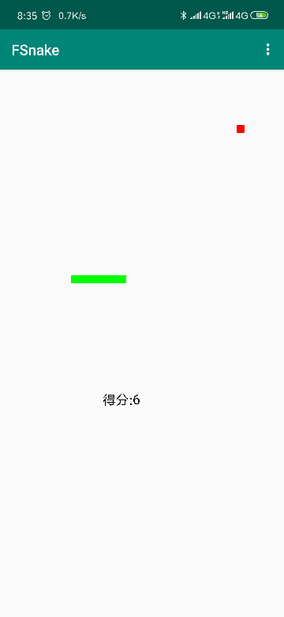
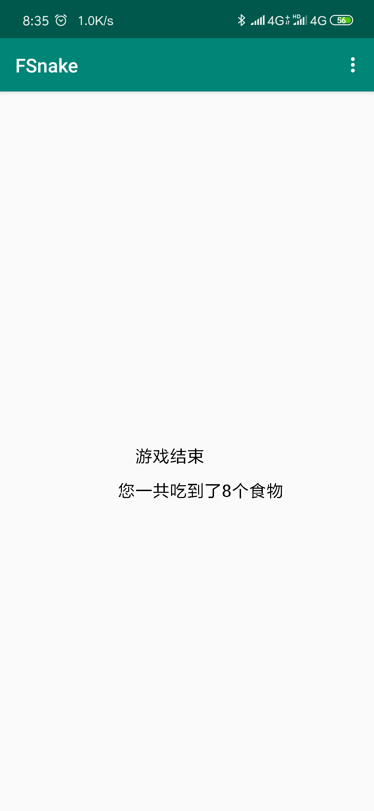
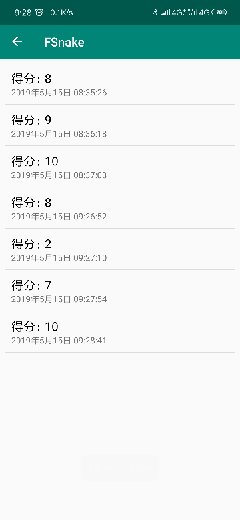

# Android高级开发技术 <课程设计>

---

## 简介

### @school <学校>

四川师范大学

### @college <学院>

计算机科学学院

### @teather <老师>

李贵洋

### @pro_name <项目名称>

FSnake(贪吃蛇)

### @author <作者>

#### @number <学号>

2016110252

#### @name <姓名>

余鑫

---

## 功能

此作品为简单的贪吃蛇小游戏，通过手势识别来控制贪吃蛇的上下左右移动，吃到食物后贪吃蛇的长度增加一，食物随机出现在地图上，具有分数显示，历史记录的功能。

## 界面

## 心得

通过这次FSnake项目的学习和实现，熟练掌握了Android绘图、SQLite数据库、Android各类控件等的使用方法。在这个过程中遇到了很多问题，但最主要的问题是对Android开发不够熟悉，需要大量的项目实践来提升自己的技术。希望在以后的学习生活中能够不断的提高自我的技术水平。
